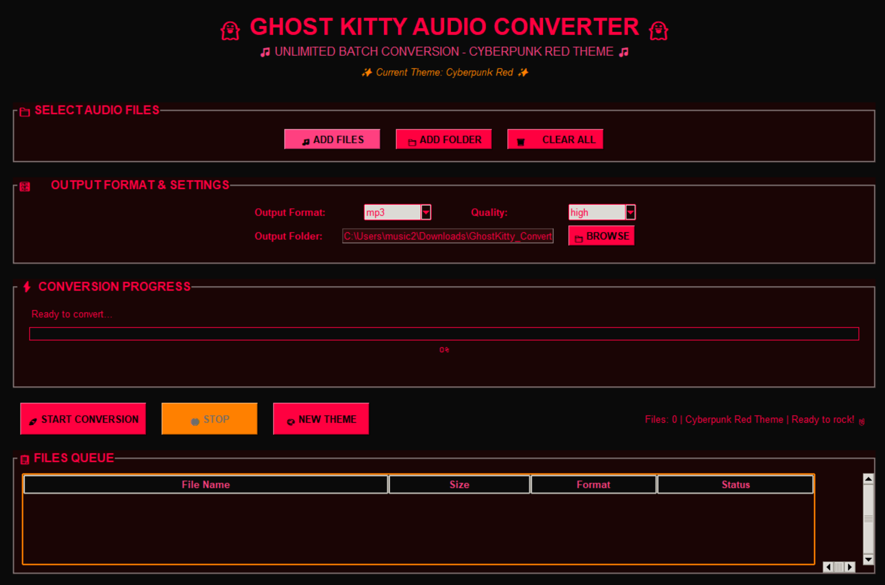

# 👻🎵 GHOST KITTY AUDIO CONVERTER - ENHA### 🎵 **Enhanced Audio Conversion**
- **Extended Format Support**: MP3, WAV, FLAC, OGG, AAC, M4A, WMA, MP4, AVI + MORE!
- **Professional Quality Settings**: Enhanced codec parameters for superior audio quality
- **Smart Batch Processing**: Convert unlimited files with intelligent queue management
- **Advanced Folder Processing**: Recursive directory scanning with file filtering
- **Real-time Progress**: Enhanced progress bars with gradients and animationsDITION 🎵👻

> **Epic Cyberpunk Audio Converter with Particle Effects & Infinite Dynamic Themes**


A **next-level cyberpunk audio converter** with **animated particle backgrounds**, **8 handcrafted themes + infinite random generation**, and professional-grade audio conversion. Experience the future of audio tools with **Cosmic Blast Boost** and unlimited theme variations!

## 🖼️ Screenshot



*Ghost Kitty Audio Converter Enhanced Edition showcasing the **Cosmic Blast Boost** theme with animated particle backgrounds, professional cyberpunk UI, enhanced neon aesthetics, and all the mega visual upgrades that make this the most epic audio converter ever created!*

## ✨ Features

### � **MEGA ENHANCED EDITION - NEW!**
- **🎆 Particle System Backgrounds**: Animated floating particles create dynamic cyberpunk atmosphere
- **🎨 8 Epic Handcrafted Themes**: Vaporwave, Synthwave, Matrix, Cyber Tokyo, Electric Ocean & more!
- **🎲 Infinite Random Theme Generation**: Mathematically generated themes with epic names like "Cosmic Blast Boost"
- **⚡ Live Theme Switching**: Instantly change themes while the app is running
- **🎯 Enhanced Visual Effects**: Hover animations, gradient progress bars, glowing buttons
- **🖥️ Professional UI Polish**: Next-level cyberpunk interface design

### 🎨 **Ultimate Dynamic Theme System**
- **Infinite Theme Variations**: Advanced HSV color generation creates unlimited unique themes
- **Epic Generated Names**: "Ultra Plasma Boost", "Mega Neural Prime", "Cyber Quantum Wave"
- **8 Signature Themes**: 
  - 👻 **Ghost Kitty Classic**: Original neon green/pink combo
  - 🌅 **Vaporwave Sunset**: Pink and cyan retro vibes  
  - ⚡ **Synthwave Neon**: Orange and yellow energy waves
  - 💚 **Matrix Digital Rain**: Classic green hacker aesthetic
  - 🌃 **Cyber Tokyo Night**: Red and blue cyberpunk city
  - 🌊 **Electric Ocean**: Cool cyan and teal tones
  - 🔥 **Solar Flare**: Warm orange cyber aesthetic
  - 🪐 **Cosmic Purple**: Deep purple space vibes

### � **Universal Audio Conversion**
- **All Major Formats**: MP3, WAV, FLAC, OGG, AAC, M4A, WMA, MP4, AVI
- **Quality Settings**: Low, Medium, High, Highest quality options
- **Batch Processing**: Convert unlimited files simultaneously
- **Folder Processing**: Add entire folders of audio files at once
- **Progress Tracking**: Real-time conversion progress with file-by-file status

### 🖥️ **Next-Level GUI Experience**
- **🎆 Animated Particle Backgrounds**: Dynamic floating particles create immersive atmosphere
- **⚡ Enhanced Button Effects**: Hover animations with glow and pulse effects
- **🌈 Gradient Progress Bars**: Professional animated progress indicators with moving highlights  
- **🎨 Real-time Theme Preview**: See theme changes instantly without restart
- **💫 Cyberpunk Interface**: Maximum immersion with neon styling and electronic aesthetics
- **🔧 Responsive Design**: Scales beautifully on any screen resolution

### ⚡ **Performance & Reliability**
- **FFmpeg Integration**: Professional-grade audio conversion engine
- **Multi-threading**: Non-blocking UI during conversion
- **Error Handling**: Comprehensive error reporting and recovery
- **Logging**: Detailed conversion logs for debugging
- **Memory Efficient**: Optimized for large batch operations  

## 🚀 Quick Start

### Two Ways to Experience the Enhanced Ghost Kitty:

#### 🎮 **Enhanced Simple Version** (Ready to Rock!)
Just run the enhanced version that works immediately:

**Linux/Mac:**
```bash
git clone https://github.com/chousemp3/GHOST-KITTY-AUDIO-CONVERTER.git
cd "GHOST KITTY AUDIO CONVERTER"
chmod +x launch_enhanced_simple.sh
./launch_enhanced_simple.sh
```

**Windows:**
```bash
git clone https://github.com/chousemp3/GHOST-KITTY-AUDIO-CONVERTER.git
cd "GHOST KITTY AUDIO CONVERTER"
python main_enhanced_fallback.py
```

#### 🔥 **Ultimate Mega Version** (All Features!)
For the full experience with optional advanced features:

```bash
python mega_installer.py  # Installs optional dependencies
python main_enhanced.py   # Full-featured mega version
```

### Prerequisites
- **Python 3.7+** (Required)
- **FFmpeg** (Required for audio conversion - see installation guide below)
- **Optional**: Advanced dependencies for maximum features (auto-installed by mega_installer.py)

## 🎛️ How to Use Enhanced Edition

### 🎵 Adding Files
- **Single Files**: Click `🎵 ADD FILES` to select individual audio files
- **Batch Folders**: Click `📁 ADD FOLDER` to add entire directories
- **Supported Formats**: MP3, WAV, FLAC, OGG, AAC, M4A, WMA, MP4, AVI, and more!

### 🎨 **Epic Theme System**
- **🎲 Random Theme**: Hit the "🎲 RANDOM THEME" button for infinite variations  
- **🎯 Preset Themes**: Click "🎨 PRESET THEMES" to browse 8 handcrafted themes
- **⚡ Live Switching**: Change themes instantly while converting files
- **🌟 Generated Names**: Each random theme gets an epic name like "Cosmic Blast Boost"

### ⚙️ Configuration
- **Output Format**: Choose your target format (MP3, WAV, FLAC, etc.)
- **Quality Settings**:
  - 🔴 **Low**: Fastest conversion, smaller files
  - 🟡 **Medium**: Balanced quality and size
  - 🟢 **High**: Excellent quality (recommended)
  - 🔥 **Highest**: Maximum quality, larger files

### 🚀 Conversion
1. Add your audio files
2. Select output format and quality
3. Choose output directory
4. Hit `🚀 START CONVERSION`
5. Watch the electronic progress bars! ⚡

### 📊 Monitoring
- **🎆 Animated Progress**: Enhanced progress bars with particle effects and gradients
- **💫 Real-time Status**: Watch each file's conversion with cyberpunk styling
- **⚡ Live Theme Effects**: Progress bars and interface adapt to current theme
- **🌟 Visual Feedback**: Hover effects and animations provide instant response

## 🛠️ Development

### Project Structure
```
ghost-kitty-audio-converter/
├── main_enhanced.py              # 🔥 Enhanced edition (full features)
├── main_enhanced_fallback.py     # ⚡ Enhanced simple (no extra dependencies)
├── main.py                       # 📦 Original version
├── enhanced_features.py          # 🎨 Theme system and visual effects
├── mega_installer.py             # 🚀 Automatic dependency installer
├── launch_enhanced_simple.sh     # 🐧 Linux/Mac launcher
├── launch.bat                    # 🪟 Windows launcher  
├── requirements.txt              # 📋 Dependencies
├── MEGA_UPGRADE_SUMMARY.md       # 📖 Feature documentation
└── ghostkitty_converter.log      # 📝 Conversion logs
```

### Code Features
- **🔥 Enhanced Edition**: Mega-upgraded with particle effects and advanced themes
- **💫 Fallback Support**: Works with or without optional dependencies  
- **⚡ Multi-threaded**: Non-blocking UI with smooth animations
- **🎨 Dynamic Theming**: Real-time theme switching and generation
- **🛡️ Error Handling**: Comprehensive error catching and recovery
- **📝 Smart Logging**: Detailed conversion logs with enhanced formatting

## 🔧 FFmpeg Installation Guide

### Windows
1. Download FFmpeg from: https://ffmpeg.org/download.html
2. Choose 'Windows builds' → 'Windows builds by BtbN'
3. Download the latest release (ffmpeg-master-latest-win64-gpl.zip)
4. Extract to C:\\ffmpeg\\
5. Add C:\\ffmpeg\\bin to your PATH environment variable:
   - Open System Properties → Advanced → Environment Variables
   - Edit 'Path' in System Variables
   - Add new entry: C:\\ffmpeg\\bin
   - Click OK and restart Ghost Kitty

Alternative (Package Managers):
- Chocolatey: `choco install ffmpeg`
- Scoop: `scoop install ffmpeg`
- Winget: `winget install FFmpeg`

### Linux
- Ubuntu/Debian: `sudo apt update && sudo apt install ffmpeg`
- CentOS/RHEL: `sudo yum install epel-release && sudo yum install ffmpeg`
- Fedora: `sudo dnf install ffmpeg`
- Arch Linux: `sudo pacman -S ffmpeg`
- openSUSE: `sudo zypper install ffmpeg`

### macOS
- Homebrew: `brew install ffmpeg`
- MacPorts: `sudo port install ffmpeg`
- Download binary: https://evermeet.cx/ffmpeg/

## 🎵 Supported Formats

### Input Formats
- **Audio**: MP3, WAV, FLAC, OGG, AAC, M4A, WMA
- **Video**: MP4, AVI, MKV, MOV, WMV, 3GP, WebM

### Output Formats
- **Audio**: MP3, WAV, FLAC, OGG, AAC, M4A, WMA
- **Video**: MP4, AVI

## 🐛 Troubleshooting

### Common Issues
- **FFmpeg Not Found**: Install FFmpeg and add it to your PATH
- **No files appearing**: Check file extensions are supported
- **Conversion failed**: Verify FFmpeg installation and file permissions
- **Slow conversion**: Try lower quality settings or check system resources
- **GUI not responding**: Ensure Python/Tkinter is properly installed

## 👻 About Ghost Kitty Enhanced Edition

Ghost Kitty Enhanced Edition takes audio conversion to the **NEXT LEVEL** with epic visual effects and unlimited creativity! 

- 🎵 **Music Lover Paradise**: Perfect for DJs, producers, and audiophiles who want style AND substance
- 🎮 **Gamer Approved**: Convert game audio with themes that match your gaming setup
- 💼 **Professional Grade**: Studio-quality conversion with cyberpunk aesthetics  
- 🔥 **Community Driven**: Enhanced by the community, for the community
- 🌟 **Future-Ready**: Built for the cyberpunk era with infinite customization

### � **What Makes Enhanced Edition Special:**
- **8 Handcrafted Themes** + **Infinite Random Generation**
- **Animated Particle Backgrounds** that react to your theme
- **Professional Visual Effects** with hover animations and gradients
- **Live Theme Switching** without restarting the app
- **Epic Generated Names** like "Cosmic Blast Boost" and "Ultra Neural Prime"
- **Enhanced Audio Processing** with more formats and better quality

---

**Made with 💜 by the Ghost Kitty Enhanced Team**

*Transform your audio, unleash your creativity, experience the cyberpunk future! 👻🎵✨*


